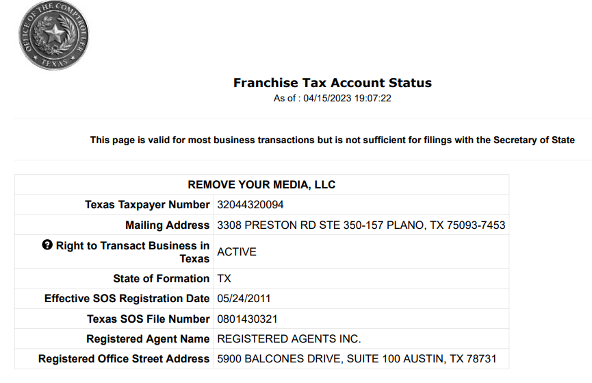

# Case Overview

- yes, they are unprofessional asf, such as the 2016 incident, where [the CEO, Eric Green, created a website that leaked the personal info of everyone that had dared to file counter-notices against his DMCA notices](https://torrentfreak.com/anti-piracy-group-reveals-personal-details-of-counter-notice-senders-160730/) (and not like Lumen, but w/o any redactions mind you)

- however, 3 years ago, right before Webtoon went public on the NASDAQ, RYM LLC went as far as filing a *17 U.S.C. § 512(h)* DMCA subpoena [against Cloudflare on behalf of Webtoon Entertainment (Naver) in federal court](https://torrentfreak.com/naver-webtoon-targets-hundreds-of-piracy-sites-ahead-of-public-listing-231024/) *(= District Court for the Northern District of Texas)*, which suggests to me that they're a legitimate company that is actually hired by distributors under [non-public proprietary](https://www.cjr.org/cloud_control/takedown_request_automation.php#:~:text=there%20that’s%20proprietary%2C”-,says%20Green,-.%20These%20methodologies%2C%20he) vendor agreements

---

## Key Individuals
Click on a name to view more information:
* [Eric Green](./eric_green) - CEO
* [Joshua Sheridan](./joshua_sheridan) - AI DMCA automation architect
* [Jamie Gardner](./jamie_gardner) - Manual Anti-Piracy Researcher
* [Evan Stone](./evan_stone) - former(?) attorney

---

## Embedded Evidence
To embed an image, just use standard Markdown. Put your image in the repository and reference it like this:
